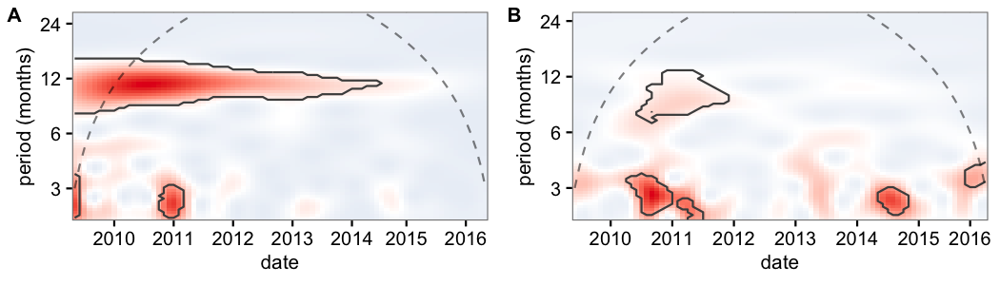
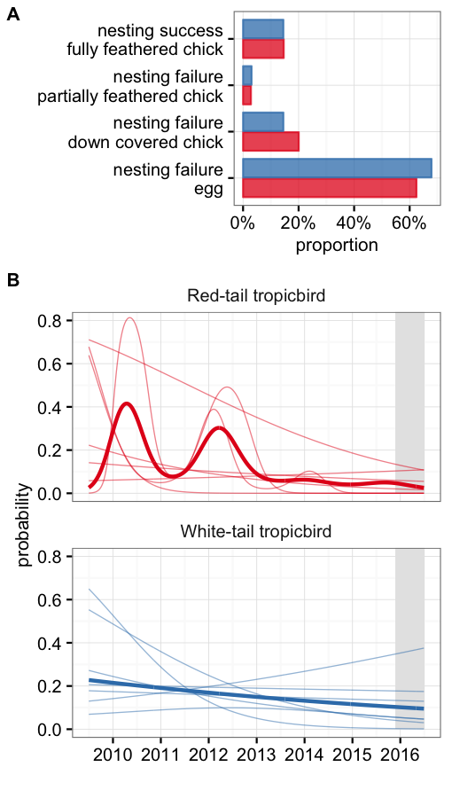

```
## Warning: package 'ggplot2' was built under R version 3.2.3
```

```
## Loading required package: nlme
```

```
## This is mgcv 1.8-7. For overview type 'help("mgcv-package")'.
```

# Summary

Aldabra supports the largest breeding populations of red-tailed (*Phaethon rubricauda*) and white-tailed tropicbird (*Phaethon lepturus*; WT) in Seychelles. These two species nest predominantly on islets in Passe Femme, south of Picard. Here we analyse 7 years of nesting monitoring data to in order to establish baselines to enable the comparison of future management interventions. We found that both the number of nests established by *P. lepturus*, and their success rate have been stable over the study period. Contrastingly the there has been a marked reduction on the number of nests established by *P. rubricauda*. This reduction is aggravated by relative low levels of nesting success after 2013.

# Key findings

* In average, Red tail tropicbird (_Phaethon rubricauda_; RT) nests are approximately twice as abundant than White tail tropicbird (_Phaethon lepturus_; WT) nests. The abundance of RT nests, however, shows a negative trend and has been in constant decline since 2010. Contrastingly the abundance of WT nests has been stable and does not show any significant temporal trend. 

* WT nesting is aperiodic and tends to be constant across the year. Contrastingly, RT nesting peaks tend to occur every year between November and February. Nevertheless, this periodicity has been unidentifiable since late 2014. It is possible that this is, at least in part, caused by the observed decline in nesting activity.

* Both species seem to roughly use the same islets for nest establishment.

* A nest is considered successful if the chick can be assumed to have fledged. In average, for both species, 15% of nests were successful with most of the unsuccessful nests (70-75%) failing before hatching occurred.

* While rates for WT have been stable over the study period, the success rate for RT has changed markedly over time. The highest rates correspond to peaks reached during early 2010 and 2012, when 30-40% of established nests were successful. For most other years, the success rate varies between 5 and 10%. Based on this data alone, it is not possible to determine whether 2010 and 2012 are the norm, and therefore the low success rates observed between 2013 and 2016 represent a marked decline, or whether 2010 and 2012 were exceptionally good years and therefore low success rates are the norm for this species in Aldabra. 

* While nesting success for WT is not significantly different among locations, it does differ for RT. Picard seem to be an important location as the nesting success rate there, especially for RT, is larger when compared to other locations. Excluding Picard, the variation on RT nesting success among islets, can be explained—to a small extent—by the islet area, with nesting success being larger in larger islets. Conversely, islet’s distance from Picard showed no effect on the success rate. 

* Overall, the available data does not offer support to the hypothesis that rats are the main driver of nest failure. This however cannot be ruled out as the interaction between nesting site quality/availability and species' preferences may affect the nests' vulnerability to rats (and other predators), and therefore explain the observed differences across locations. Temporal trends might be explained by a differential species' response to—possibly climate related—changes in food and habitat quality.

# Reccomendations

1. To continue tropicbird monitoring

2. To modify current monitoring to determine spatial and temporal trends on habitat quality, nest site availavility and nest site species' preferences.

3. To plan dedicated research effort to determine the main predators of both species' eggs and chicks and how it varies over locations and time. 

4. To investigate how current nesting success rates for *P. rubricauda* compare to other populations in the Indian Ocean and elsewhere. If they are substantialy low, management interventions that seek to reduce the number of invasive predators should be considered, even if current evidence is limited. 

# Methods

Please refer to the "Tropic Bird protocol" for details about the study site and data collection.

### Breeding seasonality

To determine the breeding periodicity (rhythmic patterns) of the focal species we used a wavelet analysis of the number of new nests per species. The wavelet decomposition identifies the dominant cycles in the time series. It quantifies the changes trough time of the power of different periods, and therefore it also allows the detection of temporal changes on the periodicity. We evaluated the significance of the results produced by the wavelet analysis by comparing them to those produced by 99 randomisations of the time series. 

Although the wavelet analysis provides an indication of the period, or duration, of the dominant cycles, it does not provide information on the timing of high and low seasons. To assess when the periods of peak and trough nesting activity occur, we used a series of generalised additive mixed effect models (GAMM) in which the response variable was, again, the total number of new nests established by each species in a monthly basis. In these models, we included *date* and *month* as smooth terms. Specifically, date was included to detect long term trends in nesting establishment, while month was included to account for the non-linear variation in nesting across the year. Finally, to account for differences in survey effort the number of surveys per month was also included as a linear predictor in these models.

Furthermore, we expect the seasonal and temporal patterns observed for nest establishment to be consistent with other indicators of nesting activity. Specifically we examined the patterns of *(i)* the number of nests that were observed to be occupied by an egg or *(ii)* small chicks not yet feathered. These two additional variables were analysed in an identical fashion as the previously described models for nest establishment.

### Breeding success

To determine whether a nest was successful of not, we determined the stage at which it was last observed. If a nest was observed to be occupied by an egg or a partially feathered chick and it was later observed empty or with signs of predation, we assumed nesting was unsuccessful. If, conversely, a nest was observed to be occupied by a fully feathered chick and in a posterior visit the nest was found to be empty and without signs of predation, we assumed that nesting was successful and therefore fledgling was likely to have occurred (hereafter nesting success). 

We then were interested on inspecting the temporal and spatial trends of nesting success and failure. Therefore, for each species, we constructed a series of GAMMs with a binomial error structure to model the probability *(i)* of nesting success, *(ii)* that nesting failed at egg stage, or *(iii)* that nesting failed at chick stage. In these models we included *date* as a smooth term to investigate temporal trends, while *location* was included as a factor to assess potential differences among islets and Picard. Competing models were assessed by comparing their Akaike information criterion (AICc). Locations for which less than 7 nests have been ever observed (roughly one per year) were excluded from this and subsequent analysis. 

These previously described models suggested marked spatial differences on nesting success, particularly for *P. rubricauda*. Anecdotal evidence suggest that invasive rats might be a major predator of tropicbird eggs and chicks. As islets might be too small to sustain permanent rat populations, we therefore explored whether islet size, and distance from Picard (which is known to have resident rats) could explain the observed differences in nesting success. We accomplished this by including these two factors in a generalised linear model (GLM) in which the response variable was the probability of nesting success of each species. As in previous analysis, we chose the most parsimonious model by comparing their AIC. 

# Results


Surveys were consistently performed between  6 February 2009 and  4 November 2016 (Figure S1). In total 202 surveys were performed at a mean frequency of 2.3 ± 0.8 (mean ± standard deviation) per month. During these trips we detected a total of 673 individual nests for *P. rubricauda* and 333 for *P. lepturus*. Islet area ranged between 41 and 570 m² (mean 249 m²), while distance from Picard ranged between 14 and 464 m (mean 177 m).

### Breeding seasonality


The wavelet analysis indicated an overall significant periodicity on the establishment of new nests by *P. rubricauda* but not for *P. lepturus* (Figure 1). For *P. rubricauda* the dominant cycle has a period of approximately twelve months, this is, peaks on nesting activity occur once a year. Nevertheless, the intensity of this yearly cycle has been damped to the point to which there has been no significant periodicity since late 2014.

The results of the wavelet analysis were strongly supported by those of the GAMMs, which indicated a significant effect of "month"" on the number of new nests established by *P. rubricauda* (*p* < 0.001; Figure 2A). With a peak on December and January, and a trough on June and July. As we expected, the number of nest occupied by downy chicks or eggs tracked the patterns shown by the number of established nests (Figure S2). 

Furthermore, when exploring the long term trends, we found a significant decrease in the number of new nests established by *P. rubricauda* over the monitoring period (*p* = < 0.001; Figure 2B). Contrastingly, for *P. lepturus*, neither the wavelet analysis nor the GAMMs showed evidence of a significant trend nor seasonal variation in the number of new nests nor the number of nest occupied by downy chicks or eggs (p = 0.33, p = 0.09, and p = 0.11 respectively; Figure 2). 



_**Figure 1:** Wavelet decomposition of the number of new nests established by (A) P. rubricauda and (B) P. lepturus for the study period. The different colours indicate how the power of a particular period (y axis) changes during the study period (x axis). Shades of red indicate a higher power relative to blue shades. Dashed lines indicate the cone of influence, above which results should not be interpreted. The black contours indicate the regions in which periodicity was significantly different from the random expectation at the 0.05 level._


```
## Error in .setupMethodsTables(fdef, initialize = TRUE): trying to get slot "group" from an object of a basic class ("NULL") with no slots
```

```
## Error in cowplot::plot_grid(p1, p2, ncol = 1, labels = c("A", "B"), label_size = 10, : object 'p1' not found
```

_**Figure 2:** Number of new nests established by *P. rubricauda* (red) and *P. lepturus* (blue) a (A) monthly, and (B) yearly basis. Boxplots show the number of observed nests while lines and points depict the output of the most parsimonious models. The shaded areas indicate the corresponding standard error. All boxes cover the 25th–75th percentiles, the middle line marks the median, and the maximum length of the whiskers is 1.5 times the interquartile range. Points outside this range show up as outliers. Both the monthly and yearly trends were significant at the 0.05 level for *P. rubricauda* but not for *P. lepturus*. Results from the 2008/09 season were excluded due to incomplete sampling._


### Breeding success


Overall, we were able to determine the outcome for 97% of the nests encountered. On average 14% of nests were successful for both species, with most of the nests failing before the egg hatched (61% for *P. rubricauda* and 66% for *P.lepturus*; Figure 3A). 

Based on terms retained by the final models (selected by AICc), we found evidence suggesting that the nesting success probability for *P. rubrucauda* varies significantly across time and space (Table S1). Across time, we observed an overall downward trend on the success probability characterised by peaks during 2010 and 2012 (Figure 3B). Consistent with this decrease on nesting success, we also detected a significant increase over time on the proportion of nests that fail before the egg hatches (Figure S3). Across space, we found that the nesting success in Picard is significantly larger when compared to other locations (Box S3, Figure S4).

Contrastingly, for *P. lepturus* we did not find evidence of any significant spatial trend. Furthermore, although date was maintained in the final model and suggest a decreasing trend, its magnitude is small and cannot be distinguished from random variation in the data at the 0.05 confidence level (Figure 3B, Table S2, Box S4).




_**Figure 3:** Nesting success for *P. rubricauda* (red) and *P. lepturus* (blue). (A) the overall proportion of stages for individual nests. (B) the modelled proabability of nesting success and failure (at the egg stage) over time. Solid lines indicate a significant effect at the 0.05 level._

When exploring the hypothesis that rat presence is the driver for the variability across locations we found that of the coovariates of rat presence, we only found evidence of a significant positive relationships of islet area and nesting success for *P. rubricauda* ($p = 0.002$). The effect of this relationship was nevertheless small and correspond to a difference of 10% increase in probability between the largest and the smallest islet. In addition, we found a negative relationship between the islet distance from Picard and the probability of failure (at an egg stage, $p = 0.132$) for *P. lepturus*. This correspond to a 27% difference between the largest and the smallest islet. We did not find a relationship between the number of nests established in an islet and the success probability. 


